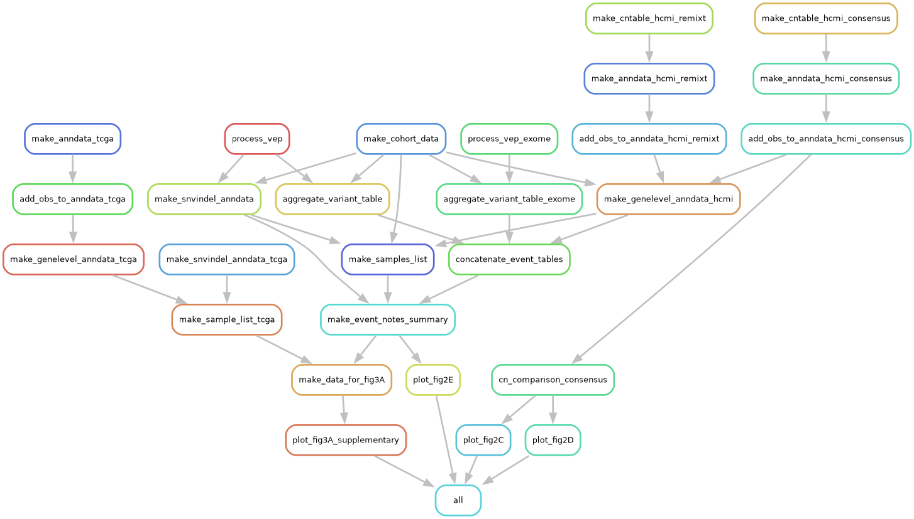

# GDAN HCMI Project: Driver event concordance pipeline

## Overview
This project is part of the **Genomic Data Analysis Network (GDAN)** initiative within the **Human Cancer Models Initiative (HCMI)**. The primary goal is to assess the concordance of driver mutations between paired **tumor** and **tumor-model** whole genome sequencing (WGS) samples.

## Usage

### Configuration
- Before running the pipeline, ensure that the copy number data, SNV/indel data, and TCGA data are downloaded into directories of your choice.
- Next, edit `pipeline/config.yaml` to map the input large data files correctly.
- If you want to start from the point where the copy number and mutation data are already compiled, you can use this Zenodo link (zenodo:...) to access `h5ad` files for the concordance calculation.

### Install python dependencies
The pipeline also requires `snakemake`, so you must make sure it's correctly installed (either through `mamba` or `pip`).
```bash
pip install -r requirements.txt
cd pysrc/
pip install .
```

### Pipeline structure
This `snakemake` pipeline is structured as shown in the following graph:


### Pipeline run command
Make sure `snakemake` is installed in your environment before proceeding. 

#### 1. Running in a cluster

The following script assumes you are using SLURM as your job distributor.

```bash
SLURM_PARTITION=componc_cpu
cluster_fmt="sbatch --partition=$SLURM_PARTITION --cpus-per-task={threads} --mem={resources.mem_mb} --job-name={rule}.{wildcards} --error=logs/{rule}/{rule}.{wildcards}.%j.err --output=logs/{rule}/{rule}.{wildcards}.%j.out --time=24:00:00"
cmd="snakemake --executor cluster-generic"
cmd="$cmd --cluster-generic-submit-cmd \"$cluster_fmt\""
cmd="$cmd --profile profile/"
cmd="$cmd --singularity-args \"--cleanenv --bind /path/to/data\""
cmd="$cmd -p"
cmd="$cmd --jobs 600"
cmd="$cmd --configfile config.yaml"
cmd="$cmd --use-singularity"
eval $cmd
```

#### 2. Running locally

You could also run the pipeline in a single node.

```bash
cmd="snakemake "
cmd="$cmd --singularity-args \"--cleanenv --bind /path/to/data\""
cmd="$cmd -p"
cmd="$cmd --jobs 50"
cmd="$cmd --configfile config.yaml"
cmd="$cmd --use-singularity"
eval $cmd
```

## Contact
For questions or collaboration, feel free to reach out to Seongmin Choi (chois7@mskcc.org).
